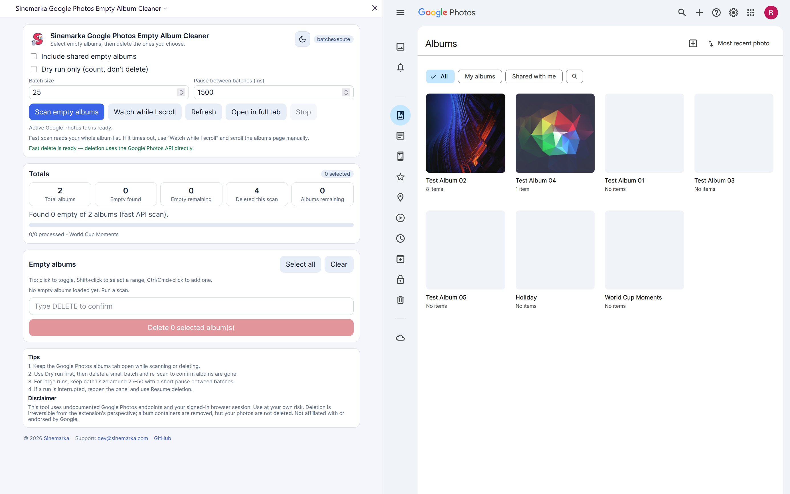
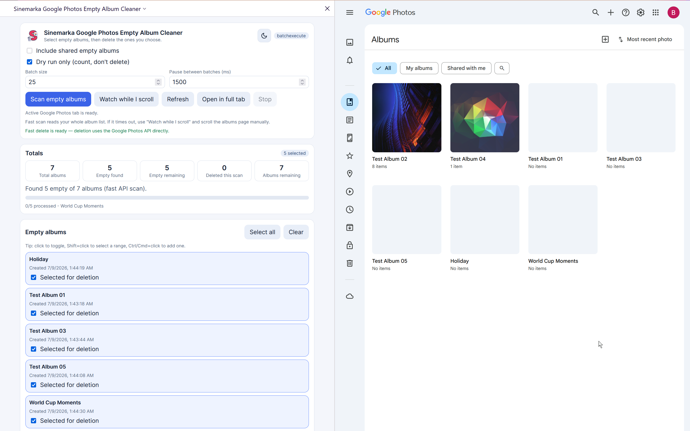
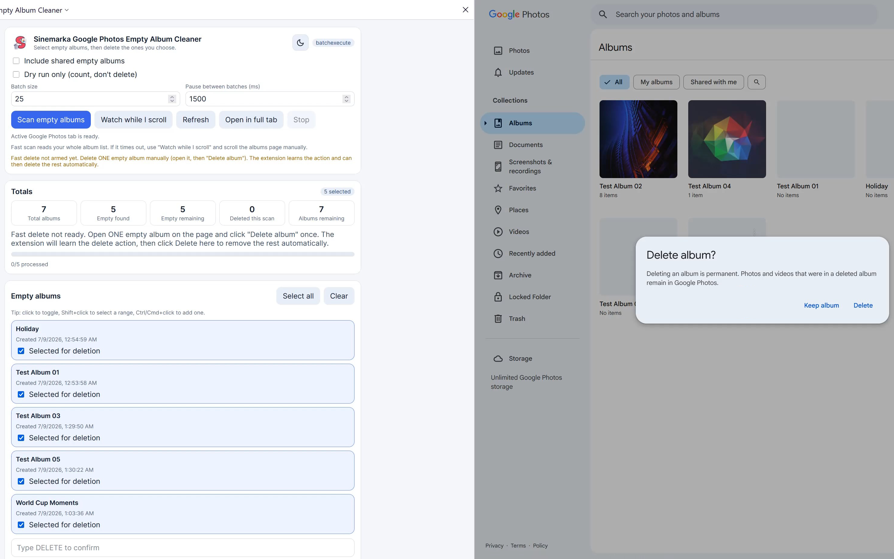
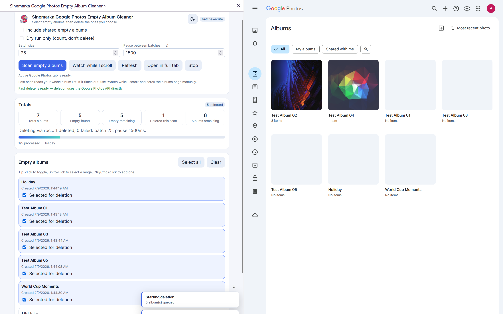
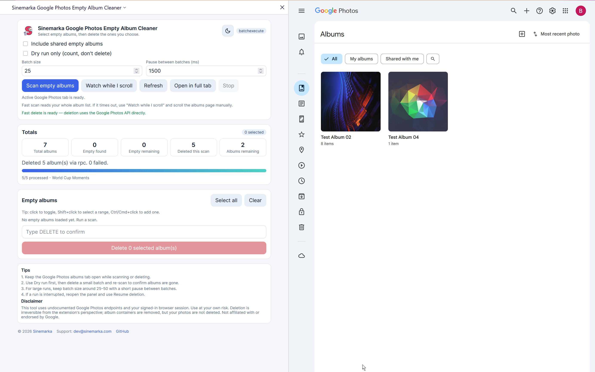
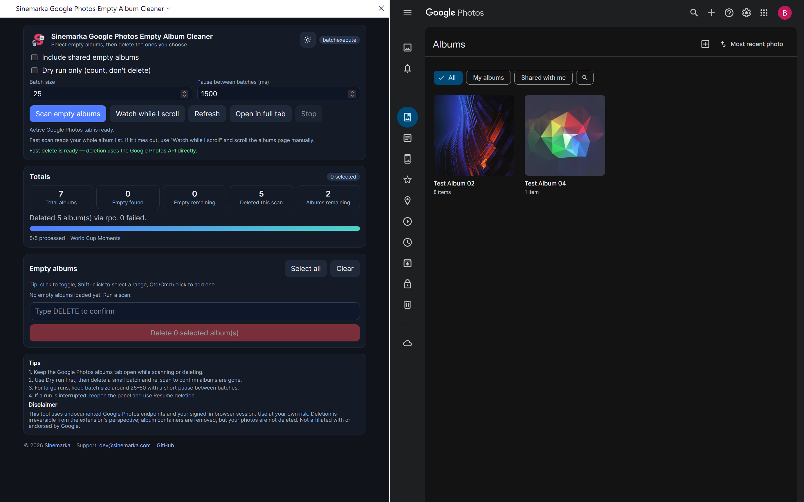

<div align="center">


# Sinemarka Google Photos Empty Album Cleaner

**Find and bulk-delete empty Google Photos albums — safely, in batches, from your own browser session.**

[](https://github.com/tolztekh/Google-Photos-Empty-Album-Cleaner)
[](LICENSE)
[](extension/manifest.firefox.json)
[](extension/manifest.chrome.json)

[Website](https://dev.sinemarka.com) · [Support](mailto:dev@sinemarka.com) · [Report an issue](https://github.com/tolztekh/Google-Photos-Empty-Album-Cleaner/issues)

</div>

---

Google Photos has no built-in way to remove hundreds or thousands of empty albums. This extension scans your library, lets you preview what will be removed, and deletes empty album containers in controlled batches — without touching your photos.

> **Battle-tested:** removed **5,599 empty albums** in a single run via the Google Photos web API on a real account.

---

## Screenshots

<table>
<tr>
<td width="50%">

**1 · Ready to scan**  
Extension sidebar alongside Google Photos, empty albums visible (`No items`).



</td>
<td width="50%">

**2 · Scan results**  
Fast scan finds empty albums; multi-select preview with totals.



</td>
</tr>
<tr>
<td width="50%">

**3 · Arm fast delete**  
Delete one album manually — the extension learns the API request.



</td>
<td width="50%">

**4 · Batch deletion**  
Progress bar, RPC deletion, configurable batch size and pause.



</td>
</tr>
<tr>
<td width="50%">

**5 · Complete**  
Empty albums removed; only albums with photos remain.



</td>
<td width="50%">

**6 · Dark theme**  
Light and dark themes with sun/moon toggle.



</td>
</tr>
</table>

---

## Features

| | |
|---|---|
| **Fast scan** | Enumerates your full album list via Google Photos' internal album-list RPC (`itemCount === 0`). |
| **Scroll fallback** | *Watch while I scroll* collects empty albums live when lazy-loading blocks a full scan. |
| **Smart selection** | Click, Shift+range, Ctrl/Cmd toggle, Select all / Clear. |
| **API deletion** | Learns the delete request from one manual delete, then replays it for thousands of albums. |
| **Batch control** | Configurable batch size + pause between batches to avoid rate limits. |
| **Resume** | Stops safely; remaining queue is persisted so you can continue later. |
| **Safety** | Dry run, type `DELETE` to confirm, per-album failure log, toast notifications. |
| **Polish** | Light/dark theme, sidebar (Chrome) / sidebar (Firefox), full-tab view. |

---

## Quick start

### Install (development)

```bash
git clone https://github.com/tolztekh/Google-Photos-Empty-Album-Cleaner.git
cd Google-Photos-Empty-Album-Cleaner
npm install
npm run build
```

| Browser | Load |
|---------|------|
| **Chrome** | `chrome://extensions` → Developer mode → Load unpacked → `dist/` |
| **Firefox** | `about:debugging` → Load Temporary Add-on → `dist-firefox/manifest.json` |

### Use

1. Open [photos.google.com/albums](https://photos.google.com/albums) and sign in.
2. Open the extension (side panel / sidebar).
3. **Scan empty albums** (or *Watch while I scroll* if the scan times out).
4. **Arm fast delete** — delete **one** empty album manually in Google Photos.
5. Select albums → tune batch size / pause → type `DELETE` → delete.

**Tip:** run **Dry run** first, then delete a small batch and re-scan to confirm counts dropped before a large run.

---

## How deletion works

Google does not document album deletion, and internal RPC ids change over time. This extension does **not** hardcode a delete endpoint.

1. You delete **one** empty album manually (menu → *Delete album*).
2. A page bridge observes the `batchexecute` request and saves a reusable template (album id → placeholder). **No auth tokens are stored.**
3. The panel shows **Fast delete is ready** — selected albums are deleted by replaying that same request.

If Google changes the API, delete one album manually again to re-learn.

---

## Security & privacy

- Runs only on `https://photos.google.com/*`
- `postMessage` restricted to the page origin (never `"*"`)
- Session tokens used in-memory only — **never persisted**
- `storage` holds settings, scan results, progress, and the token-free RPC template
- No analytics, no external servers, no third-party network calls

---

## Development

```bash
npm run build       # dist/ + dist-firefox/
npm run dev         # watch mode
npm run typecheck
npm run icons       # regenerate from logo.png
npm run release     # build + zip for store upload
```

Release zips: `release/google-photos-empty-album-cleaner-1.0.0-firefox.zip` and `-chrome.zip`

---

## Disclaimer

This tool uses undocumented Google Photos endpoints in your signed-in session. Use at your own risk. Only **empty album containers** are removed — your photos are not deleted. Not affiliated with or endorsed by Google.

---

<div align="center">

**MIT** © [Sinemarka](https://dev.sinemarka.com) · [dev@sinemarka.com](mailto:dev@sinemarka.com)

</div>
